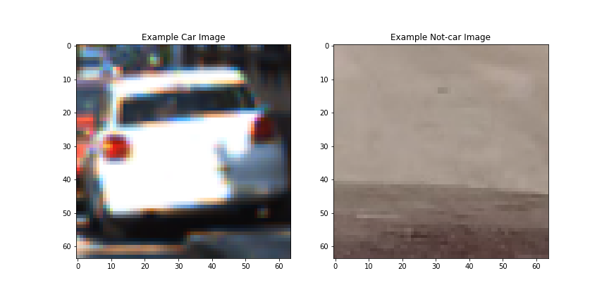
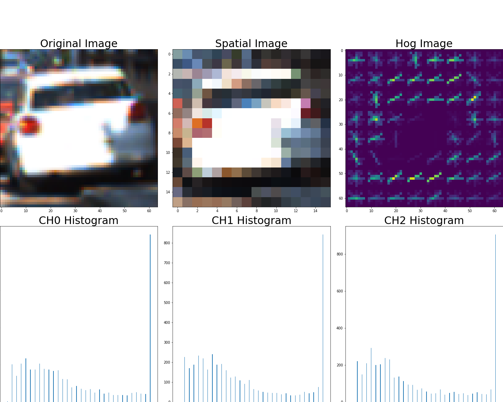
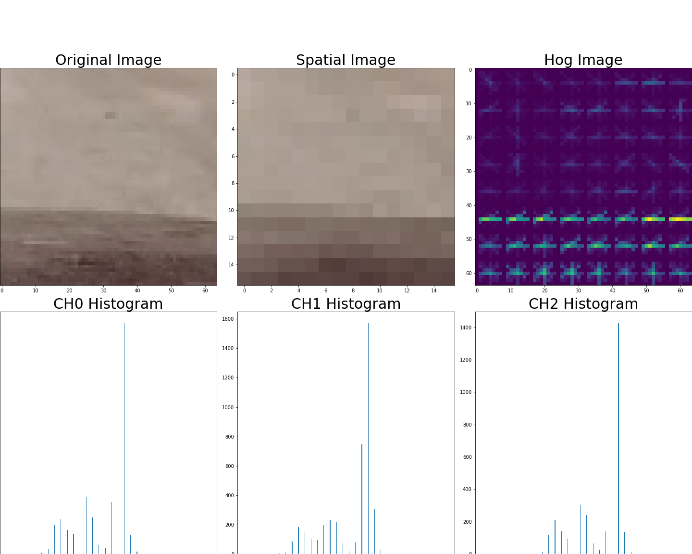
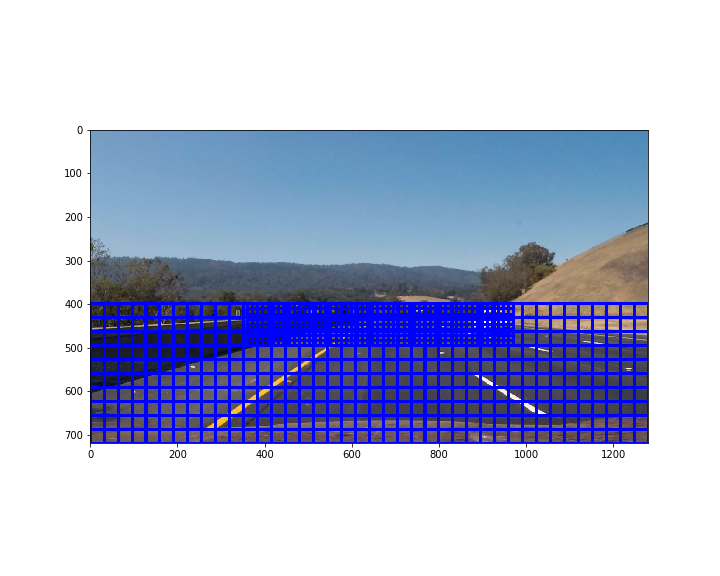
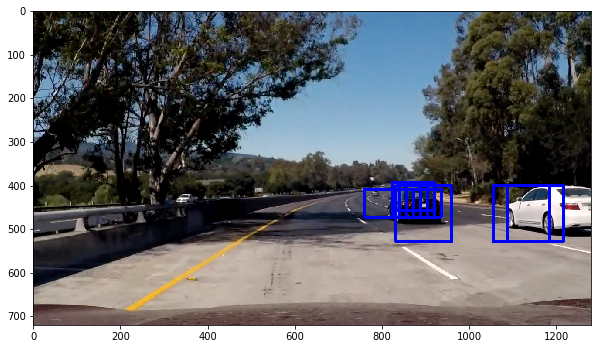
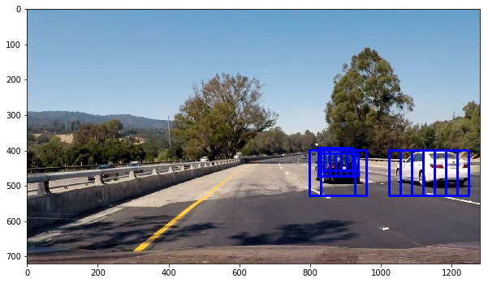
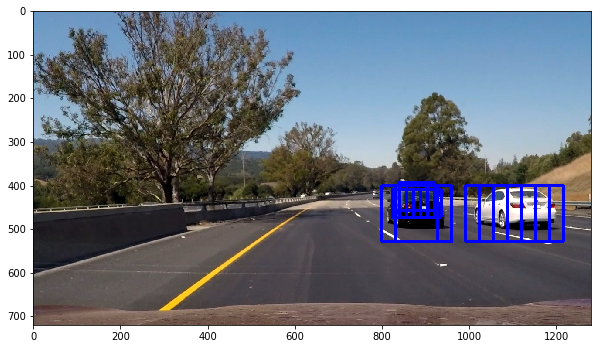
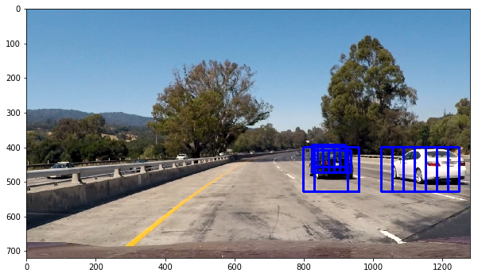
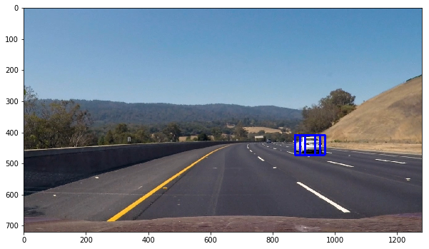

# **Project 4: Advanced Lane Finding**

### Project goal
The goal of this project is to detect vehicles with a trained classifier in a video stream captured by a front-mounted camera, and to draw bounding boxes around the detected vehicles.

### Extract image features

The labeled images provided in this class is used to train the classifier. All images in `vehicle` and `non-vehicle` are used. The size of images is `64x64`. In total, there are **8792** car images, and **8968** not-care images. Here are two examples for car and not-car images.



To extract image features, histogram of oriented gradients (HOG) with function `hog()`, and binned color features, as well as histograms of color are used. After taking examples from the class and doing a few experiments, I decide to choose `spatial_size = (16, 16)` for binned color, `hist_bins = 32` for histograms of color, and `orient = 8`, `pix_per_cell = 8`, `cell_per_block = 2`, and `hog_channel = 0` for HOG features. Here are feature examples for car and not-car images with `color_space = 'BGR'` for better illustration. In later experiments, I always use `color_space = 'LUV'` for better performance.

car image features:



not-car image features:



Total feature size is `16x16x3 + 32x3 + 7x7x2x2x8 = 2432`. Also, the features are normalized across all samples with ` StandardScaler()`.

### Train Classifier

A supporting vector machine classifier provided by `svc()` is adopted for car/non-car classification. The whole feature samples are shuffled and split into training set (80%) and testing set (20%). I tried both `linear` kernel and `rbf` kernel. The training accuracy and validation accuracy for both methods are listed below.

| SVC kernel        | linear    |   kbf         |
|:-------------:|:-------------:|:-------------:|
| training acc.     | 1.0       |0.9803         |
| validation acc.   | 0.9997    |0.9944         |

In later experiments, `kbf` kernel is used for better classification accuracy.

### Search images with sliding-window

Since I am looking for vehicles, I only need to search over the bottom half of each image. Also, the searching window needs to be large when it is close to the bottom and to be smaller when it is close to the middle of the image. After a few experiments, I settled with the following two sets of sliding-windows.

1. close-in window, larger: `x_start_stop = (0, 1280)`, `y_start_stop = (400, 720)`, `window_size = (128, 128)`
2. far-out window, smaller: `x_start_stop = (320, 980)`, `y_start_stop = (360, 500)`, `window_size = (64, 64)`

Here are an image example showing all the sliding windows in a image.



To speed up the processing, I adopted the hog feature extraction function `find_car()` with sub-sampling provided in the class, and modified it to accommodate my findings. The following images shows sliding-windows search on test images.








In the second image, there is a false positive reported.

### Process video stream
In the video stream, to eliminate false positive. a sliding-window across several consecutive frames is applies to calculate aggregated heat map. Only heat pixes higher than a pre-determined threshold will be reported as positive or vehicle detected. This piece of python code, in function `process_frames()`, is shown below.

````python
heat = np.zeros_like(image[:,:,0]).astype(np.float)
heat = add_heat(heat, boxes) # calculate the heat
if len(heat_reg) == avg_frames_n: # delete the oldest frame, when the buffer is full
    heat_reg.pop(0)
heat_reg.append(heat) # add the new frame
heat_sum = np.sum(heat_reg, axis = 0) # sum across consecutive frames
heat_sum = apply_threshold(heat_sum, thres) # Apply threshold to help remove false positives
heatmap = np.clip(heat_sum, 0, 255) # Visualize the heatmap when displaying  
labels = label(heatmap) # Find final boxes from heatmap using label function
draw_img = draw_labeled_bboxes(np.copy(image), labels) # draw labeled boxed
````
In final, the frame number in the sliding-window is set to `avg_frames_n = 6`, and the heat map threshold is set to `thres = 6`.

Here's a [link to my video result](./project_video_output.mp4).

### Discussion

It takes me lots of time and effort to put everything together for this project, particularly on tuning the threshold values and processing sanity check and smoothing on video stream. The pipeline works quite well on `project_video.mp4`, and it recognizes the lane region through the video with smooth transitions. However, it doesn't work well on `challange_video.mp4`, mostly due to the changing shadow and sunlight, which gives me a hard time for edge detection.

---

**Vehicle Detection Project**

The goals / steps of this project are the following:

* Perform a Histogram of Oriented Gradients (HOG) feature extraction on a labeled training set of images and train a classifier Linear SVM classifier
* Optionally, you can also apply a color transform and append binned color features, as well as histograms of color, to your HOG feature vector.
* Note: for those first two steps don't forget to normalize your features and randomize a selection for training and testing.
* Implement a sliding-window technique and use your trained classifier to search for vehicles in images.
* Run your pipeline on a video stream (start with the test_video.mp4 and later implement on full project_video.mp4) and create a heat map of recurring detections frame by frame to reject outliers and follow detected vehicles.
* Estimate a bounding box for vehicles detected.

[//]: # (Image References)
[image1]: ./examples/car_not_car.png
[image2]: ./examples/HOG_example.jpg
[image3]: ./examples/sliding_windows.jpg
[image4]: ./examples/sliding_window.jpg
[image5]: ./examples/bboxes_and_heat.png
[image6]: ./examples/labels_map.png
[image7]: ./examples/output_bboxes.png
[video1]: ./project_video.mp4

## [Rubric](https://review.udacity.com/#!/rubrics/513/view) Points
###Here I will consider the rubric points individually and describe how I addressed each point in my implementation.  

---
###Writeup / README

####1. Provide a Writeup / README that includes all the rubric points and how you addressed each one.  You can submit your writeup as markdown or pdf.  [Here](https://github.com/udacity/CarND-Vehicle-Detection/blob/master/writeup_template.md) is a template writeup for this project you can use as a guide and a starting point.  

You're reading it!

###Histogram of Oriented Gradients (HOG)

####1. Explain how (and identify where in your code) you extracted HOG features from the training images.

The code for this step is contained in the first code cell of the IPython notebook (or in lines # through # of the file called `some_file.py`).  

I started by reading in all the `vehicle` and `non-vehicle` images.  Here is an example of one of each of the `vehicle` and `non-vehicle` classes:

![alt text][image1]

I then explored different color spaces and different `skimage.hog()` parameters (`orientations`, `pixels_per_cell`, and `cells_per_block`).  I grabbed random images from each of the two classes and displayed them to get a feel for what the `skimage.hog()` output looks like.

Here is an example using the `YCrCb` color space and HOG parameters of `orientations=8`, `pixels_per_cell=(8, 8)` and `cells_per_block=(2, 2)`:


![alt text][image2]

####2. Explain how you settled on your final choice of HOG parameters.

I tried various combinations of parameters and...

####3. Describe how (and identify where in your code) you trained a classifier using your selected HOG features (and color features if you used them).

I trained a linear SVM using...

###Sliding Window Search

####1. Describe how (and identify where in your code) you implemented a sliding window search.  How did you decide what scales to search and how much to overlap windows?

I decided to search random window positions at random scales all over the image and came up with this (ok just kidding I didn't actually ;):

![alt text][image3]

####2. Show some examples of test images to demonstrate how your pipeline is working.  What did you do to optimize the performance of your classifier?

Ultimately I searched on two scales using YCrCb 3-channel HOG features plus spatially binned color and histograms of color in the feature vector, which provided a nice result.  Here are some example images:

![alt text][image4]
---

### Video Implementation

####1. Provide a link to your final video output.  Your pipeline should perform reasonably well on the entire project video (somewhat wobbly or unstable bounding boxes are ok as long as you are identifying the vehicles most of the time with minimal false positives.)
Here's a [link to my video result](./project_video.mp4)


####2. Describe how (and identify where in your code) you implemented some kind of filter for false positives and some method for combining overlapping bounding boxes.

I recorded the positions of positive detections in each frame of the video.  From the positive detections I created a heatmap and then thresholded that map to identify vehicle positions.  I then used `scipy.ndimage.measurements.label()` to identify individual blobs in the heatmap.  I then assumed each blob corresponded to a vehicle.  I constructed bounding boxes to cover the area of each blob detected.  

Here's an example result showing the heatmap from a series of frames of video, the result of `scipy.ndimage.measurements.label()` and the bounding boxes then overlaid on the last frame of video:

### Here are six frames and their corresponding heatmaps:

![alt text][image5]

### Here is the output of `scipy.ndimage.measurements.label()` on the integrated heatmap from all six frames:
![alt text][image6]

### Here the resulting bounding boxes are drawn onto the last frame in the series:
![alt text][image7]


---

###Discussion

####1. Briefly discuss any problems / issues you faced in your implementation of this project.  Where will your pipeline likely fail?  What could you do to make it more robust?

Here I'll talk about the approach I took, what techniques I used, what worked and why, where the pipeline might fail and how I might improve it if I were going to pursue this project further.  


#### 1. Calibrate camera distortion
Camera distortion is calibrated with the chess board images provided in directory `./camera_cal/`. As many calibration images (17 out of 19) as possible are used to improve calibration accuracy. Raw chess board images are converted to Gray scale, before applying function `cv2.findChessboardCorners()` with `nx = 9` and `ny = 6`. Distortion parameters `mtx` and `dist` are save to `./camera_dist_param.p`. Please note that this is one-time calibration, and the parameters will be used for all following images. Figure below shows a raw chess board image with camera distortion and a undistorted image with such calibration.


#### 2. Apply distortion correction to raw image
Camera distortion correction with Function `cv2.calibrateCamera()` has to be applied to every image. The following figure shows an example road image before and after distortion correction


#### 3. Create a thresholded binary image

From the undistorted image, a thresholded binary image is generated to detect edges, by combining sobel x & y, sobel magnitude & direction, and S-channel in HLS color space. The pipeline is defined in function `thresh_pipeline()`, and described in more details below. The input is the undistorted image, and the output is a binary image containing detected edges
* a) Apply Gaussian blurring `cv2.GaussianBlur()` to remove high frequency noise with `kernel_size = 5`
* b) Convert blurred image from RBG space to gray scale with function `cv2.cvtColor()`
* c) Get a thresholded binary image based on sobel x & y, with `thresh_abs = (20, 255)`
* d) Get a thresholded binary image based on sobel magnitude & direction, with `thresh_mag = (30, 255)` and `thresh_dir = (0.6, 1.1)`
* e) Convert blurred image from RBG space to HLS space. For comparison purpose, the following plot shows gray-scale image, H-channel, L-channel, and S-channel. It can be seen that lane lines are the most visible in S-channel.


* f) Get a thresholed binary image based on S-channel, with `thresh_s = (160, 255)`
* g) Combine binary images from c), d), and f), with the following python code
``` python
combined_binary = np.zeros_like(sobelx_binary)
combined_binary[(hls_binary == 1) | (((sobelx_binary == 1) & (sobely_binary == 1)) | ((sobel_mag_binary == 1) & (sobel_dir_binary == 1)))] = 1
```
* h) Define the region of interest mask for lane line search. the following image shows image with (left) and without (right) region mask.


* i) Apply region mask to the combined binary image from g). Table below shows the threshold values used for various binary images.

| Source        | Threshold   |
|:-------------:|:-------------:|
| sobel x      | (20, 255)     |
| sobel y      | (20, 255)     |
| sobel magnitude     | (30, 255)   |
| sobel direction     | (0.6, 1.1)  |
| S-channel     | (160, 255)        |

The following plot shows various thresholded binary images, combined binary images, as well as the final image with region mask applied.


#### 4. Calculate perspective transform parameters
Perspective transform is used to convert the region of interest to 'birds-eye' view or 'top-down' view. The four source points and 4 destination points are defined below.
```python
vertices = np.array([(230, 700), (580, 460), (702, 460), (1080, 700)], dtype=np.int32)
im_xsize = 1280
im_ysize = 720
x_offset = 290 # offset for dst points
y_offset = 0
dst = np.float32([[x_offset, im_ysize-y_offset], [x_offset, y_offset], [im_xsize-x_offset, y_offset], [im_xsize-x_offset, im_ysize-y_offset]])
```
This resulted in the following source and destination points:

| Source        | Destination   |
|:-------------:|:-------------:|
| 230, 700      | 290, 720      |
| 580, 460      | 290, 0        |
| 702, 460      | 990, 0        |
| 1080, 700     | 990, 720      |

Transform matrix is calculated with function `cv2.getPerspectiveTransform()`, as below.

```python
M = cv2.getPerspectiveTransform(src, dst)
invM = cv2.getPerspectiveTransform(dst, src)
```
`M` represents the transform matrix from original perspective to top-down perspective, and `invM` represents the inverse transform from top-down back to original perspective. Both matrixes are save to file `camera_warp_param.p` for future usage. The following plot shows original image and warped image (top-down) after perspective transform, as well as source and destination region in red dashed lines.


#### 5. Apply perspective transform to binary image

Perspective transform with matrix `M` is applied to every binary image from step 3, with function `cv2.warpPerspective()`, as below.
```python
image_warped = cv2.warpPerspective(image_thresh, M, image_thresh.shape[1::-1], flags=cv2.INTER_LINEAR)
```
The original binary and warped image are shown below


#### 6. Detect lane pixels and fit lane line curves
Based on the undistorted and warped binary image, lane line pixels are detected. If without any pre-knowledge of lane lines, I use the histogram method provided in Udacity class to search lane pixels in the image. There are 9 windows in total vertically, and each window is +/-100 pixels wide horizontally. After pixels are determined, a second order polynomial fitting is applied to find the best curve fitting these pixels, as below.

```python
lane_fit = np.polyfit(lane_y, lane_x, 2)
```

The following image shows detected pixels for left and right lane lines, as well as the fitted curves.


If pre-knowledge of lane lines are available, I am using such information to directly determine lane pixels. This could give more smooth and fast processing. The following figure shows lane pixels detection and lane line fitting under such scenario.


#### 7. Calculate lane curvature and vehicle position
Based on the fitted lane curve, lane curvature and vehicle positon from lane center are calculated, with the method provide in class, as below.
```python
ym_per_pix = 30/720
xm_per_pix = 3.7/700
y_eval = 720
lane_curverad = ((1 + (2*lane_fit_cir[0]*y_eval*ym_per_pix + lane_fit_cir[1])**2)**1.5) / np.absolute(2*lane_fit_cir[0])
lane_offset = lane_fit_cir[0]*(y_eval*ym_per_pix)**2 + lane_fit_cir[1]*(y_eval*ym_per_pix) + lane_fit_cir[2]
```
#### 8. Warp the detected lane boundaries back
With both lane lines are identified, the lane region is filled with light green, and is further transformed from top-down view to original perspective with matrix `invM`, as below.
```python
newwarp = cv2.warpPerspective(color_warp, invM, (image.shape[1], image.shape[0]))
```
#### 9. Display lane boundaries and curvature/position
Finally, the lane boundaries image is added on top of original image, and calculated lane curvature and vehicle positon from lane center are printed on top of that, as well. The following figure shows an example.


Now, the processing to identify lane lines for a single image is completed.

### Processing over video stream frames

In a video stream, the lane line in one frame will not change dramatically from that in the previous frame or several previous frames. If vary large change on lane line parameters, such as polynomial fitting coefficients or calculated curvature, it is very likely that something went wrong in lane line detection. So a sanity check is applied on the detection results, before it goes to final. Also, a smoothing function is applied to the final results, to reduce the impact of estimation error in a single frame. A `Line()` class is defined to record and track all the detection results, as below.
```python
class Line():
    def __init__(self):
        self.detected = 0 # Lane line already detected or not
        self.frame_cnt = 0 # total frames processed
        self.all_fit = [] # record all fitting coefficients for all frames
        self.all_fit_cir = [] # record all fitting coefficient for all frames
        self.all_curverad = [] # record curvature for all frames
        self.all_offset = [] # record offset from center for all frames
        self.current_fit = [] # current lane fitting coefficients
        self.current_fit_cir = [] # current lane fitting coefficients
        self.current_curverad = [] # current curvature
        self.current_offset = [] # current offset from lane center
        self.mis_frame = 0 # missed frames in a row
```
Here more details are discussed. These features are implemented in function `lane_fit_update()`.

#### 1. Sanity check on every single frame
The following criterion is applied:
* a) There must be sufficient amount of pixels in the lane region (>10)
* b) The difference between fitting coefficients in the next frame and those currently used must be small enough (<0.005 for second-order coefficient)
* c) The calculated curvature must be a realistic number (>300 meters for highway in the sample video)
* d) The vehicle position calculated in the next frame should have small change from current position (<50 image pixels)

Violation on any of these four will label the next frame as a missing/invalid frame, and the estimation results are discarded. And current lane line will remain to the next frame.
#### 2. Smoothing over frames
If the lane detection on the next frame is valid, the estimation results will be taken into account by a smoothing function or alpha filtering, to update the current/active estimation, such as fitting coefficients, curvature and offset, as bellow.
```python
alpha = 0.9
lane_line.current_fit = alpha * lane_line.current_fit + (1-alpha) * frame_fit
```
#### 3. Missing frames treatment
As discussed before, two lane pixels detection methods, histogram search without pre-knowledge (`line.detected == 0`) and lane region search with pre-knowledge (`line.detected == 1`), are used. At the very beginning, I defined `line.detected == 0` and start histogram search from scratch. After a frame with valid lane detection is processed, I set `line.detected == 1`. When there are more than *five* missing frames happening in a row, I will reset `line.detected == 0` to start new search, since the recorded lane lines are probably not holding any more.

Here's a [link to my video result](./project_video_output.mp4).

### Discussion

It takes me lots of time and effort to put everything together for this project, particularly on tuning the threshold values and processing sanity check and smoothing on video stream. The pipeline works quite well on `project_video.mp4`, and it recognizes the lane region through the video with smooth transitions. However, it doesn't work well on `challange_video.mp4`, mostly due to the changing shadow and sunlight, which gives me a hard time for edge detection.
